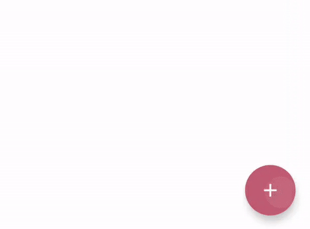

# Compose Companion

Companion composables for Compose projects

## Multi Floating Action Button

An expanding Floating Action Button that allows you to display stacked FAB actions.

You can use the Multi FAB via it's comosable constructor:

    @Composable
    fun ExpandingFab(
        fabIcon: ImageBitmap,
        items: List<MultiFabItem>,
        toState: MultiFabState,
        stateChanged: (fabstate: MultiFabState) -> Unit,
        onFabItemClicked: (item: MultiFabItem) -> Unit
    )
    
- fabIcon: The ImageBitmap to be displayed within the main floating action button
- items: The collection of MultiFabItem references that will be displayed when the FAB is expanded
- toState: The current state of the FAB. If not currently set, this state will be animated to
- stateChanged: A function to be triggered when the state of the FAB changes
- onFabItemClicked: A function to be triggered when one of the MultiFabItem references is clicked

A MultiFabItem represents the smaller FABs which are displayed when the Multi FAB is in the expanded state. Each MultiFabItem requires:

- identifier: A unique identifier for the item
- icon: The ImageBitmap to be displayed within the FAB item
- label: The label to be displayed next to the FAB item
